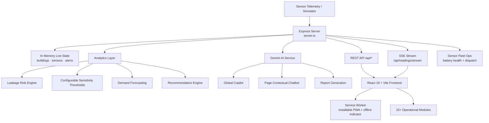

<div align="center">

# 💧 JalRakshak AI

### Enterprise Water Intelligence — Predictive Loss Prevention & Sensor Fleet Platform

**Predict Water Loss. Prevent Waste. Protect Tomorrow.**

[](https://jal-rakshak-ai-agent.vercel.app/)
[](https://vercel.com)
[](https://react.dev)
[](https://www.typescriptlang.org)
[](https://ai.google.dev)
[](#-pwa--offline-capabilities)
[](LICENSE)

<br/>

### 🔗 [**⚡ LAUNCH THE LIVE PLATFORM ⚡**](https://jal-rakshak-ai-agent.vercel.app/)

**`https://jal-rakshak-ai-agent.vercel.app/`**

<br/>

[Overview](#-overview) · [Key Features](#-core-capabilities) · [Architecture](#️-system-architecture) · [Tech Stack](#-tech-stack) · [API Reference](#-api-reference) · [Setup](#-getting-started) · [Deployment](#️-deployment) · [Roadmap](#️-roadmap)

</div>

---

## 📌 Overview

**JalRakshak AI** is an enterprise water intelligence platform that turns raw flow, pressure, tank, and quality telemetry into **early leak warnings, demand forecasts, sensor-fleet health management, and actionable conservation decisions** — with a live digital twin, a Gemini-powered copilot, and installable PWA access for field teams.

Instead of discovering a burst pipe from a shocking monthly bill, JalRakshak continuously watches inlet-vs-outlet balance, pressure behaviour, and consumption patterns across every building in a campus — flags the anomaly, estimates the loss, ranks the fix, and schedules the maintenance. Its evolved sensor-operations layer goes further: tracking **battery health across the entire sensor fleet**, letting operators tune **leak-detection sensitivity per site**, and dispatching physical battery replacements from within the app.

---

## ✨ Core Capabilities

### 📊 Master Dashboard
Unified KPI view — today's consumption and delta vs yesterday, live flow rate, leakage risk %, active alerts, tank level, water-quality score, water saved, energy saved (kWh) and CO₂ avoided (kg).

### 📡 Real-Time Monitoring (SSE)
Server-Sent Events push telemetry to every connected client — flow (LPM), pressure (bar), tank level, inlet/outlet volume, consumption rate, pH, turbidity, TDS, temperature, and conductivity.

### 🧬 Digital Water Twin
A live virtual replica of the campus water network — zones, pipelines, buildings, and sensors — with state synchronized continuously to the incoming telemetry stream.

### 🚨 Anomaly & Leakage Detection Centre
Continuous inlet-vs-outlet reconciliation and pressure-signature analysis produce a **leakage risk score** with severity classification (`NORMAL → LOW → MEDIUM → HIGH → CRITICAL`) and localization down to the building.

### 🎚️ Configurable Leak Sensitivity
Per-site leak-detection thresholds tunable across **aggressive, standard, conservative, or fully custom** presets — with a built-in threshold test runner so operators can validate a configuration before committing it live.

### 🔋 Remote Sensor Battery Fleet Management
A live battery-health view across the entire sensor network, with a configurable low-battery alert threshold and two direct operator actions: **replace battery** (log a completed swap) or **dispatch replacement** (schedule a field visit) — right from the dashboard.

### 🏥 Sensor Health View
Per-sensor operational status (`ONLINE / OFFLINE / DEGRADED / MAINTENANCE`) so failing hardware is visible before it silently corrupts the anomaly model.

### 📈 Forecasting & Optimization
Demand forecasting for pumping schedules and tank management, with optimization insights that prevent overflow and off-peak waste.

### 🧪 Water Quality Module
Tracks pH, turbidity (NTU), TDS (mg/L), conductivity (µS/cm) and temperature against a composite quality score, raising alerts on contamination-style deviations.

### 🛠️ Predictive Maintenance
Converts detected anomalies into ranked, assignable maintenance tasks with full lifecycle tracking.

### 🎛️ Digital Twin Simulator
Inject failure scenarios on demand to validate detection logic and train operators:

| Mode | Simulated Condition |
|---|---|
| `NORMAL` | Healthy baseline operation |
| `LEAKAGE_RISK` | High flow + pressure drop → elevated leak probability |
| `HIGH_CONSUMPTION` | Abnormal demand surge |
| `PRESSURE_DROP` | Supply-side pressure failure |
| `TANK_OVERFLOW` | Tank filling past safe threshold |
| `LOW_TANK` | Critical depletion scenario |
| `WATER_QUALITY_ANOMALY` | Turbidity spike and pH deviation |
| `SENSOR_FAILURE` | Degraded sensor with reduced data quality |

### 🗺️ Geospatial & Multi-Building Comparison
Map-based view of the network plus side-by-side benchmarking of consumption and efficiency across buildings.

### 🤖 JalRakshak Copilot — Dual Mode
A grounded conversational assistant available two ways: a global **JalRakshak Copilot** for platform-wide questions, and a **page-contextual chatbot** that answers questions scoped to whatever view the operator is currently looking at.

### 🌱 Sustainability & Reporting
Conservation goals, achievement badges, AI-generated report drafts, and an exportable **Report Center**.

### 🔐 Authentication & Role-Based Access
A dedicated sign-in flow with `admin` / `user` roles gating access to configuration and operator actions.

### 🔔 Notification Center & Audit Log
A centralized notification feed for alerts and system events, backed by a full, immutable **audit log** of every operator action across the platform.

---

## 📱 PWA & Offline Capabilities

JalRakshak AI installs as a native-feeling Progressive Web App — complete with a service worker (`sw.js`), an install prompt, an update-available toast, and a persistent **offline indicator** so field operators always know their connectivity state, even when signal drops during a site visit.

---

## 🏗️ System Architecture



**Request flow:** telemetry tick → state update → analytics recomputation (using configured sensitivity) → SSE broadcast → React context update → live dashboard re-render, with the service worker keeping the shell available offline.

---

## 🧰 Tech Stack

| Layer | Technology |
|---|---|
| **Frontend** | React 19, TypeScript, Vite 8, Tailwind CSS 4 |
| **UI / UX** | Lucide React icons, Motion (animations), Recharts (visualization) |
| **PWA** | Service Worker (`sw.js`), Web App Manifest, install/update prompts |
| **Backend** | Node.js, Express 4, TypeScript (`tsx` / `esbuild`) |
| **AI** | Google Gemini via `@google/genai` |
| **Realtime** | Server-Sent Events (SSE) |
| **State** | React Context (`AppContext`) |
| **Deployment** | Vercel (also ships a `render.yaml` for Render) |

---

## 🚀 Getting Started

### Prerequisites
- **Node.js 18+** (or Bun)
- A **Google Gemini API key** — [get one here](https://aistudio.google.com/apikey)

### Installation

```bash
# 1. Clone the repository
git clone https://github.com/sathi2305/JalRakshak_AI_AGENT.git
cd JalRakshak_AI_AGENT

# 2. Install dependencies
npm install          # or: bun install

# 3. Configure environment
cp .env.example .env
# then add your Gemini key to .env

# 4. Start the dev server
npm run dev
```

The app runs at **http://localhost:3000**

### Environment Variables

```env
GEMINI_API_KEY="your_gemini_api_key"
APP_URL="http://localhost:3000"
```

> 🔐 `.env` is gitignored — never commit API keys. Rotate immediately if one is ever exposed.

### Available Scripts

| Command | Description |
|---|---|
| `npm run dev` | Start dev server with Vite middleware + HMR |
| `npm run build` | Build client (Vite) and bundle server (esbuild) |
| `npm start` | Run the production build |
| `npm run lint` | Type-check with `tsc --noEmit` |
| `npm run clean` | Remove build artifacts |

---

## 🔌 API Reference

**Base URL:** `https://jal-rakshak-ai-agent.vercel.app/api`

### System & Telemetry
| Method | Endpoint | Description |
|---|---|---|
| `GET` | `/health` | Service status check |
| `GET` | `/dashboard/summary` | Aggregated KPI payload |
| `GET` | `/campuses` | Campus registry |
| `GET` | `/buildings` | All buildings with live metrics |
| `GET` | `/buildings/:id` | Detail for a single building |
| `GET` | `/readings/latest` | Most recent telemetry snapshot |
| `GET` | `/readings/history` | Historical readings series |
| `GET` | `/readings/stream` | **SSE** live telemetry stream |

### Sensor Fleet Ops
| Method | Endpoint | Description |
|---|---|---|
| `GET` | `/sensors` | Sensor inventory and health |
| `POST` | `/sensors/:id/replace-battery` | Log a completed battery replacement |
| `POST` | `/sensors/:id/dispatch-replacement` | Schedule a field battery replacement |
| `GET` / `POST` | `/config/battery-threshold` | View or set the low-battery alert threshold |
| `GET` / `POST` | `/config/leak-thresholds` | View or set leak-detection sensitivity |
| `POST` | `/config/leak-thresholds/test` | Test a threshold configuration before applying it |

### Intelligence
| Method | Endpoint | Description |
|---|---|---|
| `GET` | `/anomalies` | Detected anomalies with severity |
| `GET` | `/leakage-risk` | Leak probability and localization |
| `GET` | `/forecast` | Demand forecast series |
| `GET` | `/recommendations` | Ranked conservation actions |
| `POST` | `/recommendations/:id/apply` | Apply a recommendation |
| `GET` | `/water-quality` | Water quality parameters and score |
| `GET` | `/sustainability` | Goals, badges, and progress |

### Operations
| Method | Endpoint | Description |
|---|---|---|
| `GET` | `/alerts` | Active and historical alerts |
| `POST` | `/alerts/:id/acknowledge` | Acknowledge an alert |
| `POST` | `/alerts/:id/resolve` | Resolve an alert |
| `GET` / `POST` | `/maintenance` | List or create maintenance tasks |
| `PATCH` | `/maintenance/:id` | Update a maintenance task |
| `GET` | `/audit` | Full operator audit log |

### Simulation & AI
| Method | Endpoint | Description |
|---|---|---|
| `POST` | `/simulator/mode` | Switch the active simulation mode |
| `POST` | `/simulator/inject` | Inject a one-off fault event |
| `POST` | `/simulations/run` | Run a what-if scenario |
| `GET` | `/reports`, `/reports/latest` | List generated reports |
| `POST` | `/reports/generate` | AI-generated report draft |
| `POST` | `/copilot`, `/copilot/chat` | Ask the JalRakshak Copilot |

---

## 🗂️ Project Structure

```
JalRakshak_AI_AGENT/
├── server.ts                    # Express API, SSE engine, Gemini integration
├── render.yaml                  # Render deployment blueprint
├── vite.config.ts               # Vite + React + Tailwind config
├── index.html                   # App shell
├── public/
│   ├── manifest.json            # PWA manifest
│   └── sw.js                    # Service worker
├── .env.example                 # Environment template
└── src/
    ├── main.tsx                 # React entry point
    ├── App.tsx                  # Root layout & view router
    ├── types/index.ts           # Shared TypeScript types
    ├── context/AppContext.tsx   # Global state provider
    ├── hooks/useOnlineStatus.ts # Connectivity detection hook
    ├── services/
    │   ├── api.ts                # API client
    │   ├── telemetryStorage.ts   # Local telemetry caching
    │   └── notificationService.ts# Notification handling
    ├── data/mockDatabase.ts     # Seed campuses, sensors, pipelines, goals
    └── components/
        ├── auth/SignInPage.tsx           # Authentication
        ├── common/                        # Header, Sidebar, offline/PWA UI
        ├── dashboard/MasterDashboard.tsx  # Master dashboard
        ├── monitoring/                    # Real-time telemetry
        ├── digitaltwin/                   # Digital water twin
        ├── anomaly/                       # Anomaly & leakage centre
        ├── sensors/                        # Battery + sensitivity config, health view
        ├── forecast/                      # Forecasting & optimization
        ├── recommendations/                # Conservation actions
        ├── simulator/                      # Scenario simulator + drawer
        ├── maintenance/                     # Predictive maintenance
        ├── quality/                        # Water quality module
        ├── geospatial/                     # Map view
        ├── comparison/                      # Multi-building benchmarking
        ├── sustainability/                  # Goals & badges
        ├── reports/                         # Report centre
        ├── audit/                           # Audit log
        └── copilot/                         # Global + page-contextual chatbot
```

---

## ☁️ Deployment

Deployed on **Vercel**. A `render.yaml` blueprint is also included for Render deployment.

| Setting | Value |
|---|---|
| **Framework Preset** | Vite |
| **Build Command** | `npm run build` |
| **Output Directory** | `dist` |
| **Environment Variables** | `GEMINI_API_KEY` (set as a secret) |

**Live URL:** https://jal-rakshak-ai-agent.vercel.app/

---

## 🗺️ Roadmap

- [ ] Persistent database layer (PostgreSQL / TimescaleDB) replacing in-memory state
- [ ] Live IoT ingestion via MQTT from physical flow, pressure, and battery sensors
- [ ] ML-based leak classification trained on historical incident data
- [ ] SMS / WhatsApp alerting for field maintenance crews
- [ ] Full role-based permission granularity beyond admin/user
- [ ] PDF export for sustainability and compliance reports
- [ ] Multilingual interface for regional deployment
- [ ] Native mobile companion app for field technicians

---

## 🤝 Contributing

```bash
git checkout -b feature/your-feature-name
git commit -m "Add: clear description of your change"
git push origin feature/your-feature-name
# Open a Pull Request
```

Run `npm run lint` before submitting.

---

## 📄 License

Distributed under the MIT License. See [`LICENSE`](LICENSE) for details.

---

## 👤 Author

**Sathiyamoorthi**

[](https://github.com/sathi2305)

---

<div align="center">

### ⭐ If this project helps you, consider starring the repository.

**[💧 Try the Live Platform](https://jal-rakshak-ai-agent.vercel.app/)**

*Every drop measured is a drop saved.*

</div>
